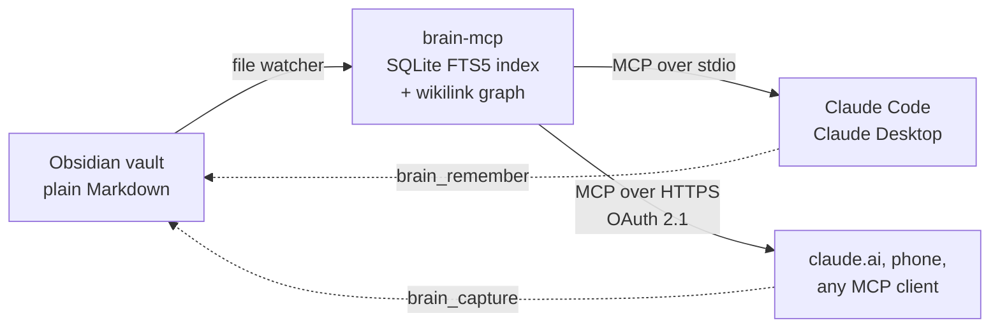
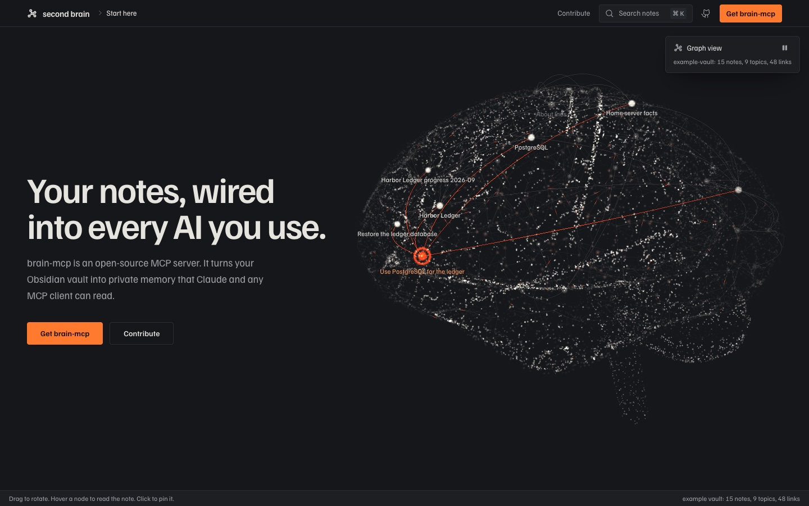

<div align="center">


# brain-mcp

**Your Obsidian vault, as memory for every AI you use.**

An open-source [Model Context Protocol](https://modelcontextprotocol.io) server that serves your notes, from your own machine, to Claude and any MCP client.

[](https://github.com/debashishthakur/brain-mcp/actions/workflows/ci.yml)
[](LICENSE)
[](CONTRIBUTING.md)
[](https://github.com/debashishthakur/brain-mcp/issues?q=is%3Aissue+is%3Aopen+label%3A%22good+first+issue%22)
[](https://github.com/debashishthakur/brain-mcp/issues?q=is%3Aissue+is%3Aopen+label%3Aresearch)


[**Website**](https://2brain.debawho.xyz) · [**Quick start**](#quick-start) · [**How it works**](#how-it-works) · [**Contribute**](#contributing) · [**Research questions**](#open-research-questions)

</div>

---

## Why brain-mcp

Every new chat starts from zero. You explain who you are, what you are building and how you like to work, and tomorrow, in another app, you explain it again.

brain-mcp keeps that context in the Markdown notes you already own. Connect any MCP client and it learns who you are, how you work, what your projects are and what you touched this week. It can search, follow links and write back to the vault as you talk.

- **Your files, your machine.** Notes stay plain Markdown in a folder you control. Nothing is uploaded to a third party.
- **One memory, every client.** Claude Code, Claude Desktop, claude.ai, your phone and anything else that speaks MCP read the same vault.
- **Deterministic and measured.** No model inside the server. Ranking is SQLite FTS5 plus fixed fusion rules, scored by a bundled retrieval eval.
- **Private by default.** OAuth 2.1 with PKCE for remote access, read, write and private scopes, secret redaction and an audit log of every call.
- **Writes back.** `brain_remember` and `brain_capture` turn what a model learns into notes you can read and edit.
- **Small and readable.** About 2,900 lines of strict TypeScript. Easy to study, easy to extend.

## How it works



1. **Index.** Every note is split into sections and indexed with its links, topics and project. A file watcher keeps the index current within a second of a save.
2. **Retrieve.** `brain_context` returns the few sections that answer a question, ranked and cited by note, packed under a size budget.
3. **Serve.** Over stdio beside your editor, over HTTP with a bearer token on your network, or behind an OAuth 2.1 login through Cloudflare Tunnel for the public internet.
4. **Remember.** `brain_remember` appends durable facts and refuses near duplicates, so memory stays clean.

<p align="center">
  
  <br />
  <sub>The bundled example vault as a knowledge graph on the <a href="https://2brain.debawho.xyz">project site</a>. Drag to rotate, hover a node to read the note.</sub>
</p>

### Tools

| Tool | What it returns |
| --- | --- |
| `brain_identity` | Persona bundle: profile note, memory notes, facts captured with `brain_remember`, skills, project list and recent focus. The server instructions ask clients to call this first. Pass `topic` for a smaller bundle. |
| `brain_context` | The sections most relevant to a question, with source note ids. Section-level FTS fused with note-level FTS, a graph-neighbour bonus and a title-match bonus, packed under a size budget. |
| `brain_search` | Full-text search with project, type, topic and since-date filters. BM25 rank fused with title overlap. |
| `brain_read` | One note, or one section of it, with metadata, topics and resolved links. |
| `brain_project` | Briefing on a project: description, latest progress, decisions, recent changes and notes grouped by type. With no argument it lists projects. |
| `brain_graph` | Links out, backlinks grouped by project, and notes that share topics. |
| `brain_recent` | Notes modified in the last N days, newest first. |
| `brain_capture` | Writes a new note with graph-ready frontmatter into the capture folder. |
| `brain_remember` | Appends a fact to the memory file; it joins `brain_identity` straight away. Near duplicates are refused (token Jaccard ≥ 0.6 or containment ≥ 0.85), partial overlaps get a `Supersedes` line, and `force=true` overrides. |

Also exposed: the resources `brain://identity` and `brain://note/{path}`, and the prompts `assume_persona` and `project_briefing`.

The index lives in `data/index.db`. It is rebuilt on every start (about 10 ms for the 15-note example vault) and kept current by the watcher. Every tool call is appended to `logs/audit.jsonl`.

## Quick start

Requires **Node 22 or newer**.

```bash
git clone https://github.com/debashishthakur/brain-mcp.git
cd brain-mcp
npm install
npm run build
node scripts/smoke.mjs
```

The repository ships with `example-vault/`, a small fictional vault belonging to Ines Varga, a backend engineer with two side projects. `brain.config.json` points at it, so the smoke test drives every tool, resource and prompt over stdio against real notes, then restores the vault.

<details>
<summary><b>All checks</b> (the same ones CI runs)</summary>

```bash
npm run typecheck
node scripts/verify.mjs          # redaction, file watcher, HTTP bearer auth, audit log
node scripts/verify-memory.mjs   # brain_remember dedupe, topic identity, brain_context
node scripts/verify-oauth.mjs    # the full OAuth 2.1 flow against a throwaway auth database
node scripts/eval-retrieval.mjs  # natural-language questions with expected notes
```

If `npm install` reports held-back install scripts, the two packages that need them (`better-sqlite3` and `esbuild`) are already listed under `allowScripts` in `package.json`. Run `npm install-scripts approve better-sqlite3 esbuild` if your npm still asks.

</details>

## Retrieval eval

`scripts/eval-retrieval.mjs` asks natural-language questions about the example vault and checks whether the expected note comes back. Current numbers, deterministic ranking only:

| Metric | Result |
| --- | --- |
| `brain_search` top-1 | 42% |
| `brain_search` top-5 | 100% |
| `brain_context` first source correct | 58% |
| `brain_context` expected note in pack | 100% |

The last row is the one a client model experiences, since it reads the whole pack. Most misses are paraphrases such as "who am I and where do I work", which share no keywords with the profile note. Closing that gap is [issue #1](https://github.com/debashishthakur/brain-mcp/issues/1).

## Use your own vault

Edit `brain.config.json`:

```json
{
  "vaultPath": "../my-vault",
  "owner": "Your Name",
  "privatePaths": ["Private/**", "Journal/**"],
  "identity": {
    "profileNote": "About me",
    "memoryProject": "Assistant Memory",
    "skillsProject": "Assistant Skills"
  }
}
```

`vaultPath` is resolved relative to the config file. Use `--config <path>` or `BRAIN_MCP_CONFIG` to keep your config outside the repository, then run `npm run reindex` to check the note count.

<details>
<summary><b>What the server reads from a note</b></summary>

Any Markdown file in the vault is indexed. Frontmatter makes it richer:

| Field | Used for |
| --- | --- |
| `title` | Display name and title matching. Falls back to the file name. |
| `type` | `hub` marks a project hub, `concept` a shared topic note. `progress` and `decision` notes get their own sections in `brain_project`. Other useful values: `runbook`, `architecture`, `plan`, `research`, `spec`, `audit`, `agent`, `note`. |
| `project` | The project a note belongs to, usually a wikilink to its hub: `"[[Harbor Ledger]]"`. |
| `topics` | Concepts the note is about, as wikilinks. Drives the topic filter and shared-topic neighbours. |
| `related`, `part-of` | Extra links, added to the graph like body wikilinks. |
| `aliases` | Other names `brain_read` and `brain_graph` will resolve. |
| `visibility` | `private` hides the note from connections without the `brain:private` scope. |
| `modified` | Date used for recency, `brain_recent` and the identity focus list. Falls back to the file's mtime. |
| `note-count`, `last-touched` | Shown next to each hub in the identity bundle. |

Wikilinks in the body (`[[Note]]`, `[[Note#Heading]]`, `[[Note|alias]]`) become graph edges. A leading `# Title` that repeats the title is dropped from what clients read, and a generated `## Connections` trailer after a `---` rule is left out of search and context.

</details>

<details>
<summary><b>How the identity bundle is assembled</b></summary>

- **Profile:** the note named by `identity.profileNote`, matched by title, alias, path or file name.
- **Memory:** every note whose `project` is `identity.memoryProject`. Write each one with a **How to apply** line; the bundle tells the client to follow them.
- **Captured facts:** the file at `memoryFile`, which `brain_remember` appends to.
- **Skills:** notes in `identity.skillsProject`, listed by their first paragraph.
- **Projects:** every note with `type: hub`.
- **Current focus:** content notes modified in the last `identity.focusWindowDays` days.

</details>

<details>
<summary><b>Configuration reference</b></summary>

| Key | Meaning |
| --- | --- |
| `vaultPath` | Vault folder, relative to the config file. |
| `owner` | Name used in the server instructions and the identity bundle. |
| `captureDir` | The only folder the server writes to. |
| `memoryFile` | File `brain_remember` appends to. Must be inside `captureDir`. |
| `ignoreDirs` | Top-level folders that are never indexed. Any path segment starting with `.` is skipped too. |
| `denyPaths` | Globs that are never served to anyone. |
| `privateProjects`, `privatePaths` | Project names and globs that need the `brain:private` scope. |
| `context.*` | `brain_context` budget, per-section cap, sections per note and candidate pool sizes. |
| `identity.*` | Profile note, memory and skills projects, focus window and size caps. |
| `http.*` | Host, port and path for HTTP modes. The shipped config uses `127.0.0.1:3737/mcp`. |
| `auth.*` | Mode, public URL, token lifetimes, lockout policy and default scopes for OAuth. |

Environment overrides: `BRAIN_MCP_CONFIG`, `BRAIN_MCP_DATA_DIR`, `BRAIN_MCP_LOG_DIR`, `BRAIN_MCP_HOST`, `BRAIN_MCP_PORT`, `BRAIN_MCP_AUTH_MODE` (`token` or `oauth`) and `BRAIN_MCP_PUBLIC_URL`.

</details>

## Connect a client

### Claude Code

```bash
claude mcp add --scope user brain -- node /absolute/path/to/brain-mcp/dist/index.js --stdio
```

Or commit a `.mcp.json` to a project so it is available whenever that folder is open:

```json
{
  "mcpServers": {
    "brain": {
      "command": "node",
      "args": ["/absolute/path/to/brain-mcp/dist/index.js", "--stdio"]
    }
  }
}
```

### Claude Desktop

Add the same `mcpServers` block to `claude_desktop_config.json` (macOS: `~/Library/Application Support/Claude/`, Windows: `%APPDATA%\Claude\`) and restart the app.

<details>
<summary><b>HTTP on your own network</b></summary>

```bash
export BRAIN_MCP_TOKEN="$(node dist/index.js --gen-token)"   # keep this somewhere safe
node dist/index.js --http                                     # http://127.0.0.1:3737/mcp
```

`BRAIN_MCP_TOKEN` grants the read, write and private scopes. `BRAIN_MCP_TOKEN_RO` grants read only. Tokens shorter than 32 characters are ignored, and the server refuses to start in this mode with no token. It binds to loopback; only expose it over a private network such as Tailscale. Anything public should use `--oauth`.

</details>

<details>
<summary><b>Remote access: claude.ai, your phone, any MCP client</b></summary>

`--oauth` starts the public transport: an OAuth 2.1 authorization server plus the protected `/mcp` endpoint, meant to listen on loopback behind Cloudflare Tunnel or another TLS-terminating proxy. `node scripts/verify-oauth.mjs` checks the whole flow end to end.

**What a client goes through.** Discovery (`/.well-known/oauth-protected-resource/mcp` → `/.well-known/oauth-authorization-server`), dynamic client registration at `/register` (https or loopback redirect URIs only), `/authorize` with PKCE S256, a login page (password plus a 6-digit authenticator code, both checked every time; five failures pause sign-in for 15 minutes), a consent page listing the scopes, then `/token`. Access tokens live one hour. Refresh tokens rotate on every use and live 30 days, and presenting a rotated-out refresh token revokes the whole grant. Tokens are opaque and stored only as SHA-256 hashes; the password is stored as an scrypt hash.

**On a Linux box** (Node 22+). Clone to `~/brain-mcp`, put your vault where `vaultPath` expects it, set `auth.publicUrl` to your hostname (for example `https://brain.example.com`), then:

```bash
~/brain-mcp/deploy/setup-linux.sh                      # builds, installs the systemd unit
cd ~/brain-mcp && node dist/index.js auth init         # password + QR code for your authenticator app
sudo systemctl start brain-mcp
```

Then follow the Cloudflare Tunnel steps the script prints. `deploy/cloudflared-config.yml` is the ingress template.

**On a Windows box** (elevated PowerShell, Node 22+ via `winget install OpenJS.NodeJS.LTS`). Clone to `$HOME\brain-mcp`, then:

```powershell
Set-ExecutionPolicy -Scope Process Bypass -Force
& "$HOME\brain-mcp\deploy\setup-windows.ps1"   # builds, registers a boot-time task as SYSTEM, disables sleep
cd $HOME\brain-mcp; node dist\index.js auth init
Start-ScheduledTask -TaskName brain-mcp
```

**Connect clients**

- claude.ai: Settings → Connectors → Add custom connector → `https://brain.example.com/mcp`. Sign in once on the page that opens.
- Claude Code: `claude mcp add --scope user --transport http brain https://brain.example.com/mcp`, then run `/mcp` and authenticate.
- Anything else that speaks MCP over HTTP with OAuth: the same URL.

**Manage access** from the box:

```bash
node dist/index.js auth status          # configured? counts, recent failures
node dist/index.js auth clients         # every registered client and its live grants
node dist/index.js auth grants          # active refresh grants with last-used time
node dist/index.js auth revoke-client <client_id>
node dist/index.js auth revoke-all
node dist/index.js auth set-password    # or rotate-totp
```

Keep the vault fresh on the box with Syncthing, or a git push and a pull on a timer. The watcher picks changes up within a second.

</details>

## Security model

- **Transport.** stdio inherits the OS user. HTTP needs a bearer token compared in constant time, and each session is bound to the client id that opened it.
- **Scopes.** `brain:read`, `brain:write`, `brain:private`. Notes marked `visibility: private`, or matched by `privateProjects` or `privatePaths`, need the private scope. `denyPaths` are never served. The example vault keeps one note under `Private/` so you can watch this work.
- **Redaction.** Credential-shaped strings (Anthropic, OpenAI, GitHub, AWS, Google, Slack and Stripe keys, JWTs, private keys, `password=` style assignments, credentials embedded in URLs) are masked as `[REDACTED:kind]` before they leave the server.
- **Writes** are confined to `captureDir`. Path traversal outside it is refused.
- **Audit.** Every call records timestamp, transport, client, session, tool, truncated arguments, note ids returned and redaction count.

Found a vulnerability? Please report it privately, as described in [SECURITY.md](SECURITY.md).

## Roadmap

- [x] Section-level full-text search with title and graph fusion
- [x] Remote access with OAuth 2.1, PKCE, password and authenticator code
- [x] Secret redaction, scopes and an audit log
- [x] Live index with a file watcher
- [ ] Hybrid recall: local embeddings fused with BM25 ([#1](https://github.com/debashishthakur/brain-mcp/issues/1))
- [ ] Graph expansion with Personalized PageRank over wikilinks ([#2](https://github.com/debashishthakur/brain-mcp/issues/2))
- [ ] Abstain when nothing is relevant ([#3](https://github.com/debashishthakur/brain-mcp/issues/3))
- [ ] Harder eval questions ([#4](https://github.com/debashishthakur/brain-mcp/issues/4))
- [ ] Docker image ([#5](https://github.com/debashishthakur/brain-mcp/issues/5))
- [ ] Importers for other note tools ([#6](https://github.com/debashishthakur/brain-mcp/issues/6))
- [ ] Passkey sign-in ([#7](https://github.com/debashishthakur/brain-mcp/issues/7))
- [ ] Temporal memory ([#8](https://github.com/debashishthakur/brain-mcp/issues/8))

## Contributing

> [!IMPORTANT]
> **brain-mcp is built to be learned from and experimented on, and it needs contributors to succeed.** It is a small, readable codebase with a real, measurable problem at its centre: helping an AI find the right note in someone's personal knowledge. If you are learning how MCP servers work, studying retrieval, or researching memory for AI systems, this is a good place to do it, and every improvement you make is measured by the bundled eval.

### Good for learning

| You want to learn | Start here |
| --- | --- |
| How an MCP server exposes tools, resources and prompts | `src/tools.ts`, `src/index.ts` |
| Full-text search, BM25 and rank fusion | `src/vault/index.ts`, `src/context.ts` |
| Turning wikilinks and frontmatter into a knowledge graph | `src/vault/parse.ts` |
| OAuth 2.1 with PKCE, token rotation and TOTP | `src/auth/` |
| Scopes and secret redaction | `src/policy.ts` |
| Evaluating retrieval honestly | `scripts/eval-retrieval.mjs` |

### Open research questions

Each of these is an open issue with a suggested approach and a definition of done:

- **Do local embeddings beat BM25 on personal notes**, where vocabulary is idiosyncratic and questions are paraphrased? ([#1](https://github.com/debashishthakur/brain-mcp/issues/1))
- **Can the graph a vault already has replace an LLM-built one** for multi-hop questions? ([#2](https://github.com/debashishthakur/brain-mcp/issues/2))
- **When should retrieval abstain?** Calibrating a "nothing relevant" floor. ([#3](https://github.com/debashishthakur/brain-mcp/issues/3))
- **How should AI memory handle facts that change over time?** ([#8](https://github.com/debashishthakur/brain-mcp/issues/8))
- **How do you evaluate retrieval over personal data** without sharing that data? Start with a harder public eval set. ([#4](https://github.com/debashishthakur/brain-mcp/issues/4))

### How to contribute

1. **Pick something.** Browse [good first issues](https://github.com/debashishthakur/brain-mcp/issues?q=is%3Aissue+is%3Aopen+label%3A%22good+first+issue%22), [research questions](https://github.com/debashishthakur/brain-mcp/issues?q=is%3Aissue+is%3Aopen+label%3Aresearch) or [help wanted](https://github.com/debashishthakur/brain-mcp/issues?q=is%3Aissue+is%3Aopen+label%3A%22help+wanted%22), or open an issue with your idea.
2. **Run the checks.** Everything runs against the bundled example vault, so no personal data is needed.
3. **Measure.** If your change touches ranking, run `node scripts/eval-retrieval.mjs` before and after and paste both into the pull request. Good ideas win on numbers.
4. **Open a pull request.** CI builds, typechecks and runs every verification script.

Read [CONTRIBUTING.md](CONTRIBUTING.md) for the details, and please follow the [code of conduct](CODE_OF_CONDUCT.md).

### Citing

If you use brain-mcp in research or teaching, please cite it. GitHub's **Cite this repository** button uses [CITATION.cff](CITATION.cff).

## Project structure

```text
brain-mcp/
├── src/
│   ├── index.ts          entry point: stdio, --http, --oauth, --reindex
│   ├── tools.ts          the nine MCP tools, resources and prompts
│   ├── context.ts        brain_context: fusion and packing under a budget
│   ├── identity.ts       the persona bundle
│   ├── memory.ts         brain_remember and near-duplicate checks
│   ├── policy.ts         scopes and secret redaction
│   ├── vault/            parsing notes and the SQLite FTS5 index
│   └── auth/             OAuth 2.1 server, login page, TOTP, token store
├── scripts/              smoke test, verification scripts, retrieval eval
├── example-vault/        a fictional vault used by every script
├── deploy/               Linux and Windows setup, Cloudflare Tunnel template
└── brain.config.json
```

## License

[MIT](LICENSE). Created by [Debashish Thakur](https://github.com/debashishthakur).
