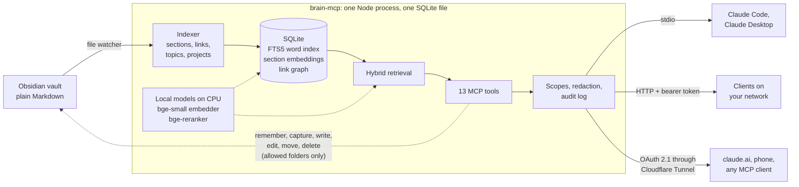
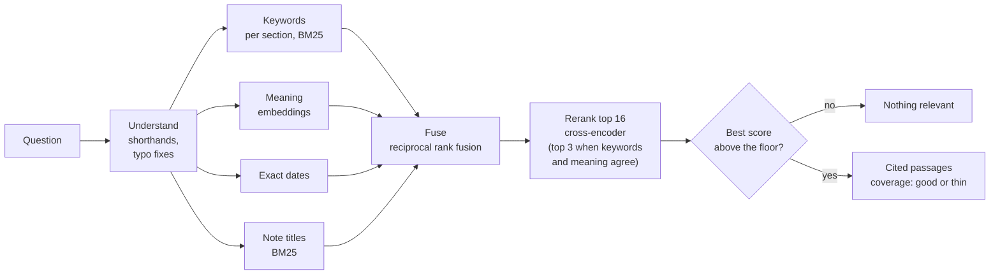

<div align="center">


# brain-mcp

**Your Obsidian vault, as memory for every AI you use.**

An open-source [Model Context Protocol](https://modelcontextprotocol.io) server that serves your notes, from your own machine, to Claude and any MCP client.

[](https://github.com/debashishthakur/brain-mcp/actions/workflows/ci.yml)
[](https://www.npmjs.com/package/debawho-brain-mcp)
[](LICENSE)
[](CONTRIBUTING.md)
[](https://github.com/debashishthakur/brain-mcp/issues?q=is%3Aissue+is%3Aopen+label%3A%22good+first+issue%22)
[](https://github.com/debashishthakur/brain-mcp/issues?q=is%3Aissue+is%3Aopen+label%3Aresearch)


[**Website**](https://2brain.debawho.xyz) · [**Quick start**](#quick-start) · [**How it works**](#how-it-works) · [**Contribute**](#contributing) · [**Research questions**](#open-research-questions)

</div>

---

## Why brain-mcp

Every new chat starts from zero. You explain who you are, what you are building and how you like to work, and tomorrow, in another app, you explain it again.

brain-mcp keeps that context in the Markdown notes you already own. Connect any MCP client and it learns who you are, how you work, what your projects are and what you touched this week. It can search, follow links and write back to the vault as you talk.

- **Your files, your machine.** Notes stay plain Markdown in a folder you control. Nothing is uploaded to a third party.
- **One memory, every client.** Claude Code, Claude Desktop, claude.ai, Cursor, Hermes Agent, your phone and anything else that speaks MCP read the same vault.
- **Hybrid retrieval, fully local.** Keyword search plus meaning search with a small embedding model, then a reranker, all on your CPU. It can also answer "the vault does not record this" instead of guessing.
- **Measured.** Every ranking change is scored by two bundled evals, keyword and hybrid side by side.
- **Private by default.** OAuth 2.1 with PKCE for remote access, read, write and private scopes, secret redaction and an audit log of every call.
- **Writes back.** `brain_remember` and `brain_capture` turn what a model learns into notes you can read and edit.
- **Small and readable.** About 3,800 lines of strict TypeScript. Easy to study, easy to extend.

## How it works



1. **Index.** Every note is split into sections and indexed with its links, topics and project. Each section also gets an embedding (`bge-small-en-v1.5`) in the background. A file watcher keeps both current within a second of a save.
2. **Retrieve.** A question goes through five steps:
   - **Understand:** expand shorthands (`pg` → PostgreSQL) and fix typos against the vault's own words.
   - **Search four ways:** keywords per section (BM25), meaning (embeddings), exact dates, and note titles.
   - **Fuse** the four lists with reciprocal rank fusion.
   - **Rerank** the best candidates with a cross-encoder (`bge-reranker-base`). When keyword and meaning search agree on the top hit, only the top 3 are reranked.
   - **Decide:** if even the best passage scores below a floor, answer "nothing relevant"; otherwise return the strong hits, cited by note, with a coverage label (good, thin, none).
3. **Serve.** Over stdio beside your editor, over HTTP with a bearer token on your network, or behind an OAuth 2.1 login through Cloudflare Tunnel for the public internet.
4. **Remember and write.** `brain_remember` appends durable facts and refuses near duplicates. Four more tools write, edit, move and delete hand-written notes, inside the folders you allow.

The retrieval step from question to answer:



Everything runs on your machine: the models are downloaded once into `data/models`, and no note leaves the server. If the models are not ready yet, retrieval falls back to keywords, so the server never blocks. Set `BRAIN_MCP_HYBRID=0` to stay keyword-only.

> [!NOTE]
> **The architecture is intentionally simple right now, and ideas are welcome.** It is one process and one SQLite file, with a hybrid ranker built from fixed rules. Some of it is already tweakable: the `retrieval` block in `brain.config.json` (embedding and reranker models, how many candidates to rerank, the score blend, the "nothing relevant" floor, your own shorthands), context budgets under `context`, and fusion constants such as `RRF_K` and `TITLE_BONUS` in `src/vault/index.ts`. Much more could become configurable, such as pluggable retrievers and storage, graph strategies, and query rewriting. If you have an idea, [open an issue](https://github.com/debashishthakur/brain-mcp/issues/new/choose) or a research proposal, even before there is code.

<p align="center">
  
  <br />
  <sub>The bundled example vault as a knowledge graph on the <a href="https://2brain.debawho.xyz">project site</a>. Drag to rotate, hover a node to read the note.</sub>
</p>

### Tools

| Tool | What it returns |
| --- | --- |
| `brain_identity` | Persona bundle: profile note, memory notes, facts captured with `brain_remember`, skills, project list and recent focus. The server instructions ask clients to call this first. Pass `topic` for a smaller bundle. |
| `brain_context` | The sections most relevant to a question, with source note ids and a coverage label, from the hybrid ranker, packed under a size budget. Says so explicitly when the vault does not record the answer. |
| `brain_search` | Hybrid search (keywords, meaning, reranker, spelling correction) with project, type, topic and date filters. Returns ranked notes with snippets. |
| `brain_read` | One note, or one section of it, with metadata, topics and resolved links. |
| `brain_project` | Briefing on a project: description, latest progress, decisions, recent changes and notes grouped by type. With no argument it lists projects. |
| `brain_graph` | Links out, backlinks grouped by project, and notes that share topics. |
| `brain_recent` | Notes modified in the last N days, newest first. |
| `brain_capture` | Writes a new note with graph-ready frontmatter into the capture folder. |
| `brain_remember` | Appends a fact to the memory file; it joins `brain_identity` straight away. Near duplicates are refused (token Jaccard ≥ 0.6 or containment ≥ 0.85), partial overlaps get a `Supersedes` line, and `force=true` overrides. |
| `brain_write` | Creates a note at a chosen path in a writable folder (`Notes/` and the capture folder by default), or replaces one with `overwrite=true`. A `hub` note groups every note whose `project` matches its title. |
| `brain_edit` | Changes part of a note in one of three ways: replace text that matches once, replace a section under a heading, or append. Keeps the file's line endings and bumps `modified`. |
| `brain_move` | Moves or renames a note within the writable folders. Never overwrites, and names any notes whose links stop resolving. |
| `brain_delete` | Moves a note into `.trash/`, which is never indexed. Nothing is erased. |

The four write tools need the `brain:write` scope. They refuse notes a pipeline generates, hidden folders, paths outside the vault, and the memory file, which stays append-only through `brain_remember`.

Also exposed: the resources `brain://identity` and `brain://note/{path}`, and the prompts `assume_persona` and `project_briefing`.

The index lives in `data/index.db`, embeddings included. It is rebuilt on every start (about 10 ms for the 15-note example vault) and kept current by the watcher; embeddings are keyed by a hash of the text, so unchanged sections are never embedded twice. Every tool call is appended to `logs/audit.jsonl`.

## Quick start

Requires **Node 22 or newer**. One command sets it up on your notes:

```bash
npx debawho-brain-mcp init
```

It lists the Obsidian vaults on your machine and asks which one to serve (or makes a starter vault in `~/second-brain`), asks your name, fetches the two search models once (about 300 MB), and offers to connect Claude Code for you. Your notes stay where they are; the config, index and logs go in `~/.brain-mcp/`. Then ask Claude "what do you know about me?"

To connect a client yourself, Claude Code:

```bash
claude mcp add --scope user brain -- npx -y debawho-brain-mcp --stdio
```

[Hermes Agent](https://github.com/NousResearch/hermes-agent):

```bash
hermes mcp add brain --command npx --args -y debawho-brain-mcp --stdio
```

Claude Desktop, Cursor and other clients that read an `mcpServers` config:

```json
{
  "mcpServers": {
    "brain": { "command": "npx", "args": ["-y", "debawho-brain-mcp", "--stdio"] }
  }
}
```

On Windows, put `cmd /c` in front of `npx`: `"command": "cmd", "args": ["/c", "npx", "-y", "debawho-brain-mcp", "--stdio"]`. Run `npx debawho-brain-mcp --help` for the HTTP and OAuth modes.

### From source

For development, the checks and evals, or Docker:

```bash
git clone https://github.com/debashishthakur/brain-mcp.git
cd brain-mcp
npm install
npm run build
node scripts/smoke.mjs
```

The repository ships with `example-vault/`, a small fictional vault belonging to Ines Varga, a backend engineer with two side projects. `brain.config.json` points at it, so the smoke test drives every tool, resource and prompt over stdio against real notes, then restores the vault.

The first hybrid query downloads the two models (about 300 MB) from Hugging Face into `data/models`. After that, everything runs offline.

### Make it yours (from source)

```bash
npm run setup
```

The same setup as `init`, for a clone. It asks for your name (it suggests the one from `git config`) and where your notes are. Point it at an existing Obsidian vault, or press Enter for a starter vault in `my-vault/` with a profile note to fill in. It writes `brain.config.local.json`, which git ignores and the server uses from then on, with its own index so your notes never mix with the example. It ends by printing the `claude mcp add` command for your machine: run it, then ask Claude "what do you know about me?"

Delete `brain.config.local.json` to go back to the example vault. The checks and evals always run against the example vault, so they keep passing after setup.

<details>
<summary><b>All checks</b> (the same ones CI runs)</summary>

```bash
npm run typecheck
node scripts/verify.mjs          # redaction, file watcher, HTTP bearer auth, audit log
node scripts/verify-memory.mjs   # brain_remember dedupe, topic identity, brain_context
node scripts/verify-write.mjs    # write, edit, move and delete on a throwaway vault
node scripts/verify-oauth.mjs    # the full OAuth 2.1 flow against a throwaway auth database
node scripts/verify-hybrid.mjs   # hybrid search: refusal, spelling, identifiers, context
node scripts/verify-setup.mjs    # npm run setup, in a temp folder
node scripts/verify-package.mjs  # the npm package as a new user gets it: pack, install, init, serve
node scripts/eval-retrieval.mjs  # 12 questions, keyword vs hybrid
node scripts/eval-hybrid.mjs     # 15 harder questions: paraphrase, typo, identifier, date, multi-hop, alias, off-topic
node scripts/debug-rank.mjs "your question"   # trace one query through every ranking step
```

If `npm install` reports held-back install scripts, the two packages that need them (`better-sqlite3` and `esbuild`) are already listed under `allowScripts` in `package.json`. Run `npm install-scripts approve better-sqlite3 esbuild` if your npm still asks. The scripts of `onnxruntime-node` and `protobufjs` are not needed for CPU use.

</details>

## Run with Docker

Token-mode HTTP server in a container, using the example vault by default.

```bash
export BRAIN_MCP_TOKEN="$(node -e "console.log(require('crypto').randomBytes(32).toString('hex'))")"
docker compose up --build
```

The compose file publishes `127.0.0.1`-friendly port `3737`, mounts `brain.config.json` and `example-vault` read-only, and keeps `data/` and `logs/` on the host. Health is checked at `GET /healthz`.

**Keep the service private.** The container binds `0.0.0.0` only so Docker can publish the port. Publish it on loopback (`127.0.0.1:3737:3737`) or a private network such as Tailscale — do not expose it to the public internet. Anything public should use OAuth (`--oauth`) behind a TLS proxy, as in the security model below.

To use your own vault, point `vaultPath` at a host mount (or replace the `example-vault` volume) and keep `BRAIN_MCP_CONFIG` on a config file whose `vaultPath` matches that mount.

## Retrieval eval

Two scripts score retrieval on the example vault, keyword and hybrid side by side. Results are deterministic and reproducible from a fresh clone.

**`eval-retrieval.mjs`**, 12 everyday questions:

| Ranker | Right note first | Right note in top 5 | Expected note in the context pack | Time per question (laptop CPU) |
| --- | --- | --- | --- | --- |
| Keyword only | 42% | 100% | 100% | 2 ms |
| Hybrid (default) | **67%** | 75% | 75% | about 0.6 s |

**`eval-hybrid.mjs`**, 15 harder questions:

| Ranker | Right note first | Right note in top 5 | Off-topic questions refused |
| --- | --- | --- | --- |
| Keyword only | 67% | 100% | 2 of 3 |
| Hybrid (default) | 67% | 75% | **3 of 3** |

Hybrid search puts the right note first far more often and refuses questions the vault cannot answer. Its weak spot is the "nothing relevant" floor: on these short example notes it also refuses some real questions, such as "the raspberry pi overheating in the sun". Calibrating that floor is [issue #3](https://github.com/debashishthakur/brain-mcp/issues/3), and a faster reranker is [issue #10](https://github.com/debashishthakur/brain-mcp/issues/10). When you point the server at your own vault, replace the cases with questions about your notes.

## Use your own vault

`npx debawho-brain-mcp init`, or `npm run setup` in a clone, does this for you. To do it by hand, copy `brain.config.json` to `brain.config.local.json` (or `~/.brain-mcp/config.json` for the npm package) and change what differs:

```json
{
  "vaultPath": "../my-vault",
  "dataDir": "./data/local",
  "owner": "Your Name",
  "privatePaths": ["Private/**", "Journal/**"],
  "identity": {
    "profileNote": "About me",
    "memoryProject": "Assistant Memory",
    "skillsProject": "Assistant Skills"
  }
}
```

`vaultPath` and `dataDir` are resolved relative to the config file. The server uses the first config it finds: `--config <path>`, then `BRAIN_MCP_CONFIG`, then `brain.config.local.json`, then `~/.brain-mcp/config.json` (npm package only), then `brain.config.json`. Run `npm run reindex` to check the note count; the first log line names the config in use.

<details>
<summary><b>What the server reads from a note</b></summary>

Any Markdown file in the vault is indexed. Frontmatter makes it richer:

| Field | Used for |
| --- | --- |
| `title` | Display name and title matching. Falls back to the file name. |
| `type` | `hub` marks a project hub, `concept` a shared topic note. `progress` and `decision` notes get their own sections in `brain_project`. Other useful values: `runbook`, `architecture`, `plan`, `research`, `spec`, `audit`, `agent`, `note`. |
| `project` | The project a note belongs to, usually a wikilink to its hub: `"[[Harbor Ledger]]"`. |
| `topics` | Concepts the note is about, as wikilinks. Drives the topic filter and shared-topic neighbours. |
| `related`, `part-of` | Extra links, added to the graph like body wikilinks. |
| `aliases` | Other names `brain_read` and `brain_graph` will resolve. |
| `visibility` | `private` hides the note from connections without the `brain:private` scope. |
| `modified` | Date used for recency, `brain_recent` and the identity focus list. Falls back to the file's mtime. |
| `note-count`, `last-touched` | Shown next to each hub in the identity bundle. |

Wikilinks in the body (`[[Note]]`, `[[Note#Heading]]`, `[[Note|alias]]`) become graph edges. A leading `# Title` that repeats the title is dropped from what clients read, and a generated `## Connections` trailer after a `---` rule is left out of search and context.

</details>

<details>
<summary><b>How the identity bundle is assembled</b></summary>

- **Profile:** the note named by `identity.profileNote`, matched by title, alias, path or file name.
- **Memory:** every note whose `project` is `identity.memoryProject`. Write each one with a **How to apply** line; the bundle tells the client to follow them.
- **Captured facts:** the file at `memoryFile`, which `brain_remember` appends to.
- **Skills:** notes in `identity.skillsProject`, listed by their first paragraph.
- **Projects:** every note with `type: hub`.
- **Current focus:** content notes modified in the last `identity.focusWindowDays` days.

</details>

<details>
<summary><b>Configuration reference</b></summary>

| Key | Meaning |
| --- | --- |
| `vaultPath` | Vault folder, relative to the config file. |
| `dataDir` | Folder for the search index and the OAuth database, relative to the config file. Default: `data/` in a clone, `~/.brain-mcp/data/` for the npm package. Setup sets `./data/local`, so your index never mixes with the example vault's. The models stay in `data/models` either way. |
| `owner` | Name used in the server instructions and the identity bundle. |
| `captureDir` | The only folder the server writes to. |
| `memoryFile` | File `brain_remember` appends to. Must be inside `captureDir`. |
| `ignoreDirs` | Top-level folders that are never indexed. Any path segment starting with `.` is skipped too. |
| `denyPaths` | Globs that are never served to anyone. |
| `privateProjects`, `privatePaths` | Project names and globs that need the `brain:private` scope. |
| `context.*` | `brain_context` budget, per-section cap, sections per note and candidate pool sizes. |
| `identity.*` | Profile note, memory and skills projects, focus window and size caps. |
| `retrieval.*` | Hybrid ranking: `hybrid` on or off, `embedModel`, `rerankModel`, `rerankN` (candidates to rerank), `blend` (fused rank vs reranker), `floor` (below it, "nothing relevant"), `keepRatio`, `earlyExit`, and `aliases` for your own shorthands. Every field is optional. |
| `writableDirs` | Folders the write, edit, move and delete tools may change. Default: the capture folder and `Notes`. |
| `http.*` | Host, port and path for HTTP modes. The shipped config uses `127.0.0.1:3737/mcp`. |
| `auth.*` | Mode, public URL, token lifetimes, lockout policy and default scopes for OAuth. |

Environment overrides: `BRAIN_MCP_HOME` (where the npm package keeps its config, index and logs; default `~/.brain-mcp`), `BRAIN_MCP_CONFIG`, `BRAIN_MCP_DATA_DIR`, `BRAIN_MCP_LOG_DIR`, `BRAIN_MCP_HOST`, `BRAIN_MCP_PORT`, `BRAIN_MCP_AUTH_MODE` (`token` or `oauth`), `BRAIN_MCP_PUBLIC_URL`, and `BRAIN_MCP_HYBRID=0` to switch back to keyword-only ranking.

</details>

## Connect a client

### Claude Code

```bash
claude mcp add --scope user brain -- npx -y debawho-brain-mcp --stdio
```

From a clone, run the build instead: `claude mcp add --scope user brain -- node /absolute/path/to/brain-mcp/dist/index.js --stdio`.

Or commit a `.mcp.json` to a project so it is available whenever that folder is open:

```json
{
  "mcpServers": {
    "brain": {
      "command": "node",
      "args": ["/absolute/path/to/brain-mcp/dist/index.js", "--stdio"]
    }
  }
}
```

### Claude Desktop

Add the same `mcpServers` block to `claude_desktop_config.json` (macOS: `~/Library/Application Support/Claude/`, Windows: `%APPDATA%\Claude\`) and restart the app.

### Hermes Agent

```bash
hermes mcp add brain --command npx --args -y debawho-brain-mcp --stdio
hermes mcp test brain    # connects and lists the 13 tools
```

The tools appear in Hermes as `mcp_brain_brain_identity`, `mcp_brain_brain_context` and so on. For the remote server, use `hermes mcp add brain --url https://brain.example.com/mcp --auth oauth` and sign in once.

### Agent skill

[`skills/brain-mcp`](skills/brain-mcp) is a SKILL.md that teaches an agent to use the server well: load the owner's identity only for their own work, pick the right tool for each question, cite note ids, say when the vault doesn't record something, and write back only with the owner's consent. Copy the folder into your agent's skills directory, for example `~/.claude/skills/brain-mcp/` for Claude Code. It is instructions only, with no scripts.

<details>
<summary><b>HTTP on your own network</b></summary>

```bash
export BRAIN_MCP_TOKEN="$(node dist/index.js --gen-token)"   # keep this somewhere safe
node dist/index.js --http                                     # http://127.0.0.1:3737/mcp
```

`BRAIN_MCP_TOKEN` grants the read, write and private scopes. `BRAIN_MCP_TOKEN_RO` grants read only. Tokens shorter than 32 characters are ignored, and the server refuses to start in this mode with no token. It binds to loopback; only expose it over a private network such as Tailscale. Anything public should use `--oauth`.

</details>

<details>
<summary><b>Remote access: claude.ai, your phone, any MCP client</b></summary>

`--oauth` starts the public transport: an OAuth 2.1 authorization server plus the protected `/mcp` endpoint, meant to listen on loopback behind Cloudflare Tunnel or another TLS-terminating proxy. `node scripts/verify-oauth.mjs` checks the whole flow end to end.

**What a client goes through.** Discovery (`/.well-known/oauth-protected-resource/mcp` → `/.well-known/oauth-authorization-server`), dynamic client registration at `/register` (https or loopback redirect URIs only), `/authorize` with PKCE S256, a login page (password plus a 6-digit authenticator code, both checked every time; five failures pause sign-in for 15 minutes), a consent page listing the scopes, then `/token`. Access tokens live one hour. Refresh tokens rotate on every use and live 30 days, and presenting a rotated-out refresh token revokes the whole grant. Tokens are opaque and stored only as SHA-256 hashes; the password is stored as an scrypt hash.

**On a Linux box** (Node 22+). Clone to `~/brain-mcp`, put your vault where `vaultPath` expects it, set `auth.publicUrl` to your hostname (for example `https://brain.example.com`), then:

```bash
~/brain-mcp/deploy/setup-linux.sh                      # builds, installs the systemd unit
cd ~/brain-mcp && node dist/index.js auth init         # password + QR code for your authenticator app
sudo systemctl start brain-mcp
```

Then follow the Cloudflare Tunnel steps the script prints. `deploy/cloudflared-config.yml` is the ingress template.

**On a Windows box** (elevated PowerShell, Node 22+ via `winget install OpenJS.NodeJS.LTS`). Clone to `$HOME\brain-mcp`, then:

```powershell
Set-ExecutionPolicy -Scope Process Bypass -Force
& "$HOME\brain-mcp\deploy\setup-windows.ps1"   # builds, registers a boot-time task as SYSTEM, disables sleep
cd $HOME\brain-mcp; node dist\index.js auth init
Start-ScheduledTask -TaskName brain-mcp
```

**Connect clients**

- claude.ai: Settings → Connectors → Add custom connector → `https://brain.example.com/mcp`. Sign in once on the page that opens.
- Claude Code: `claude mcp add --scope user --transport http brain https://brain.example.com/mcp`, then run `/mcp` and authenticate.
- Anything else that speaks MCP over HTTP with OAuth: the same URL.

**Manage access** from the box:

```bash
node dist/index.js auth status          # configured? counts, recent failures
node dist/index.js auth clients         # every registered client and its live grants
node dist/index.js auth grants          # active refresh grants with last-used time
node dist/index.js auth revoke-client <client_id>
node dist/index.js auth revoke-all
node dist/index.js auth set-password    # or rotate-totp
```

Keep the vault fresh on the box with Syncthing, or a git push and a pull on a timer. The watcher picks changes up within a second.

</details>

## Security model

- **Transport.** stdio inherits the OS user. HTTP needs a bearer token compared in constant time, and each session is bound to the client id that opened it.
- **Scopes.** `brain:read`, `brain:write`, `brain:private`. Notes marked `visibility: private`, or matched by `privateProjects` or `privatePaths`, need the private scope. `denyPaths` are never served. The example vault keeps one note under `Private/` so you can watch this work.
- **Redaction.** Credential-shaped strings (Anthropic, OpenAI, GitHub, AWS, Google, Slack and Stripe keys, JWTs, private keys, `password=` style assignments, credentials embedded in URLs) are masked as `[REDACTED:kind]` before they leave the server.
- **Writes** are confined to the writable folders (`writableDirs`). Generated notes, hidden folders and paths outside the vault are refused, and deletes go to `.trash/`.
- **Local models.** Embeddings and reranking run on your CPU. Note text is never sent to a model service.
- **Audit.** Every call records timestamp, transport, client, session, tool, truncated arguments, note ids returned and redaction count.

Found a vulnerability? Please report it privately, as described in [SECURITY.md](SECURITY.md).

## Roadmap

- [x] Section-level full-text search with title and graph fusion
- [x] Remote access with OAuth 2.1, PKCE, password and authenticator code
- [x] Secret redaction, scopes and an audit log
- [x] Live index with a file watcher
- [x] Hybrid retrieval: local embeddings fused with BM25, a cross-encoder reranker, spelling correction ([#1](https://github.com/debashishthakur/brain-mcp/issues/1))
- [x] Write, edit, move and delete tools for hand-written notes
- [ ] Calibrate the "nothing relevant" floor so real questions are not refused ([#3](https://github.com/debashishthakur/brain-mcp/issues/3))
- [ ] A faster reranker that keeps accuracy ([#10](https://github.com/debashishthakur/brain-mcp/issues/10))
- [ ] Graph expansion with Personalized PageRank over wikilinks ([#2](https://github.com/debashishthakur/brain-mcp/issues/2))
- [ ] Harder eval questions ([#4](https://github.com/debashishthakur/brain-mcp/issues/4))
- [x] Docker image ([#5](https://github.com/debashishthakur/brain-mcp/issues/5)) — `Dockerfile` + `docker-compose.yml`, see [Run with Docker](#run-with-docker)
- [ ] Importers for other note tools ([#6](https://github.com/debashishthakur/brain-mcp/issues/6))
- [ ] Passkey sign-in ([#7](https://github.com/debashishthakur/brain-mcp/issues/7))
- [ ] Temporal memory ([#8](https://github.com/debashishthakur/brain-mcp/issues/8))

## Contributing

> [!IMPORTANT]
> **brain-mcp is built to be learned from and experimented on, and it needs contributors to succeed.** It is a small, readable codebase with a real, measurable problem at its centre: helping an AI find the right note in someone's personal knowledge. If you are learning how MCP servers work, studying retrieval, or researching memory for AI systems, this is a good place to do it, and every improvement you make is measured by the bundled eval.
>
> The architecture is deliberately simple today, so there is plenty of room to reshape it. Proposals to make parts of it configurable or swappable are as welcome as code.

### Good for learning

| You want to learn | Start here |
| --- | --- |
| How an MCP server exposes tools, resources and prompts | `src/tools.ts`, `src/index.ts` |
| Hybrid search: BM25, embeddings, rank fusion | `src/vault/index.ts`, `src/context.ts` |
| Running embedding and reranker models on a CPU | `src/vault/dense.ts` |
| Turning wikilinks and frontmatter into a knowledge graph | `src/vault/parse.ts` |
| OAuth 2.1 with PKCE, token rotation and TOTP | `src/auth/` |
| Scopes and secret redaction | `src/policy.ts` |
| Evaluating retrieval honestly | `scripts/eval-retrieval.mjs` |

### Open research questions

Each of these is an open issue with a suggested approach and a definition of done:

- **When should retrieval abstain?** Hybrid search refuses all off-topic questions, but also some real ones. Calibrating the floor is open. ([#3](https://github.com/debashishthakur/brain-mcp/issues/3))
- **Which reranker gives the best accuracy per millisecond on a CPU?** A model six times faster finds the right note in 58% of everyday questions instead of 75%. ([#10](https://github.com/debashishthakur/brain-mcp/issues/10))
- **Can the graph a vault already has replace an LLM-built one** for multi-hop questions? ([#2](https://github.com/debashishthakur/brain-mcp/issues/2))
- **How should AI memory handle facts that change over time?** ([#8](https://github.com/debashishthakur/brain-mcp/issues/8))
- **How do you evaluate retrieval over personal data** without sharing that data? Start with a harder public eval set. ([#4](https://github.com/debashishthakur/brain-mcp/issues/4))

### How to contribute

1. **Pick something.** Browse [good first issues](https://github.com/debashishthakur/brain-mcp/issues?q=is%3Aissue+is%3Aopen+label%3A%22good+first+issue%22), [research questions](https://github.com/debashishthakur/brain-mcp/issues?q=is%3Aissue+is%3Aopen+label%3Aresearch) or [help wanted](https://github.com/debashishthakur/brain-mcp/issues?q=is%3Aissue+is%3Aopen+label%3A%22help+wanted%22), or open an issue with your idea.
2. **Run the checks.** Everything runs against the bundled example vault, so no personal data is needed.
3. **Measure.** If your change touches ranking, run `node scripts/eval-retrieval.mjs` before and after and paste both into the pull request. Good ideas win on numbers.
4. **Open a pull request.** CI builds, typechecks and runs every verification script.

Read [CONTRIBUTING.md](CONTRIBUTING.md) for the details, and please follow the [code of conduct](CODE_OF_CONDUCT.md).

### Citing

If you use brain-mcp in research or teaching, please cite it. GitHub's **Cite this repository** button uses [CITATION.cff](CITATION.cff).

## Project structure

```text
brain-mcp/
├── src/
│   ├── index.ts          entry point: init, stdio, --http, --oauth, --reindex
│   ├── tools.ts          the 13 MCP tools, resources and prompts
│   ├── context.ts        brain_context: fusion and packing under a budget
│   ├── identity.ts       the persona bundle
│   ├── memory.ts         brain_remember and near-duplicate checks
│   ├── policy.ts         scopes and secret redaction
│   ├── vault/            parsing notes, the SQLite index, hybrid ranking
│   │   └── dense.ts      local embeddings and the reranker
│   └── auth/             OAuth 2.1 server, login page, TOTP, token store
├── scripts/              setup, smoke test, verification scripts, retrieval eval
├── templates/            the starter vault init and npm run setup create
├── example-vault/        a fictional vault used by every script
├── deploy/               Linux and Windows setup, Cloudflare Tunnel template
└── brain.config.json     the example vault's config; npm run setup writes yours beside it
```

## License

[MIT](LICENSE). Created by [Debashish Thakur](https://github.com/debashishthakur).
